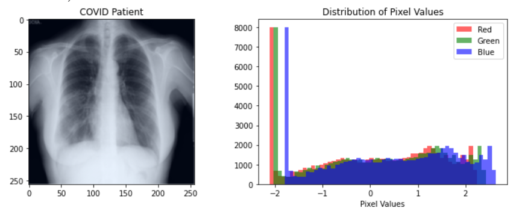
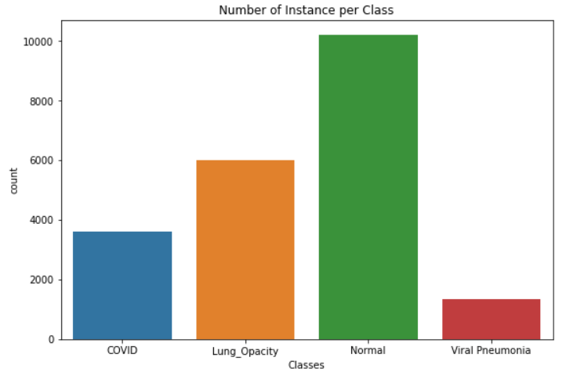
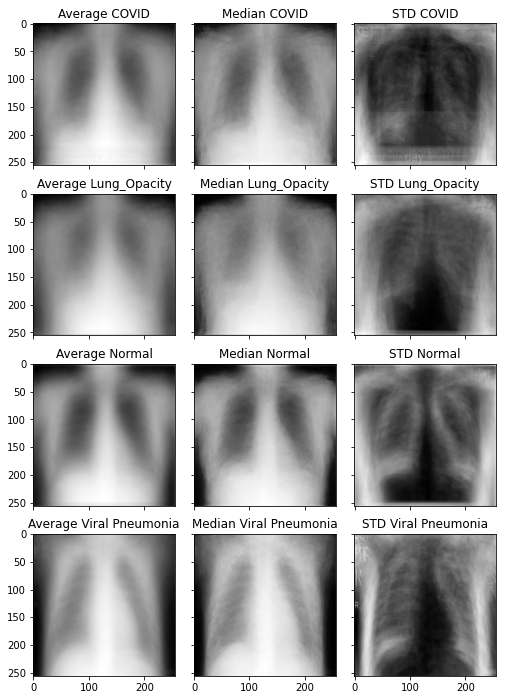
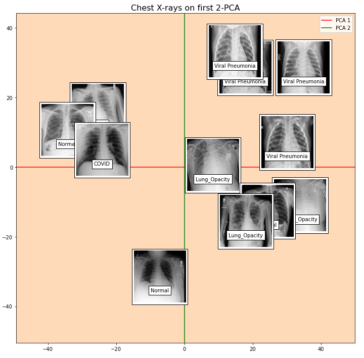
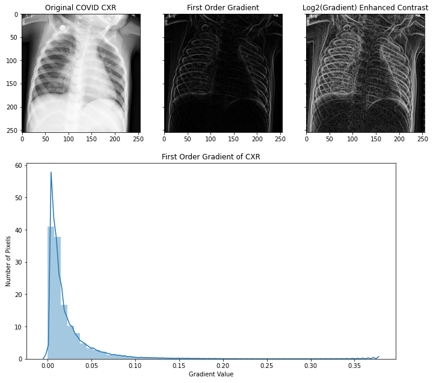
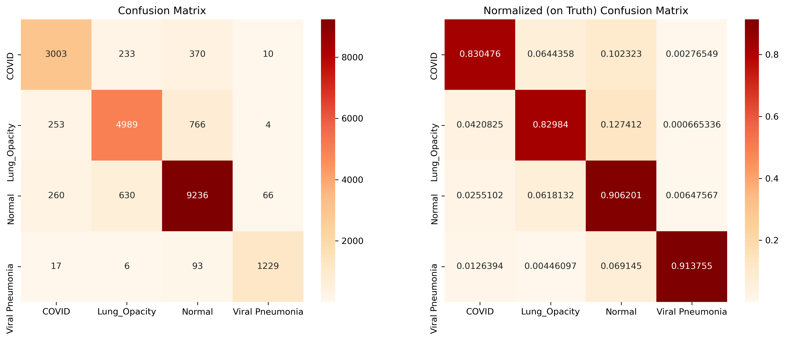
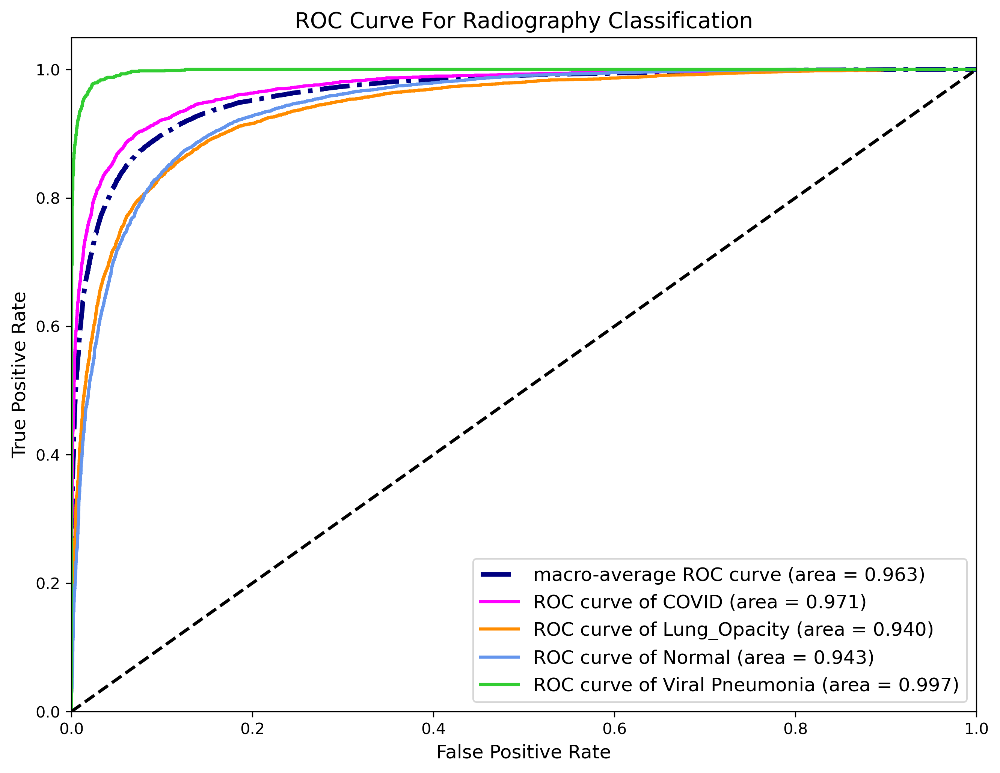

# Project Radiography Classification

Name: Edward (Yida) Chen  
Class: CSCI 349 - Intro to Data Mining  
Semester: Spring 2021  
Instructor: [Prof. Brian King](https://www.bucknell.edu/fac-staff/brian-king)

Dataset: COVID-19 Radiography Database [1][2]  
Dataset Repository: [Kaggle COVID-19 Radiography Database](https://www.kaggle.com/tawsifurrahman/covid19-radiography-database)

# 1. Problem Statement: Classifying Pneumonia Infection using CXR Images

In this project, I work on a **clinical Radiography dataset** that contains 21165 Chest X-ray images from medical institutions [1][2]. Each image has a dimension of 299 x 299 pixels (89401 pixels in total). The project's task is to **classify the patients' pneumonia infection** using **Chest X-ray** images. 

The **four possible classifications** for a Chest X-ray image are:
1. **COVID-19 infection**
2. **Non-COVID pneumonia infection** 
3. **Non-COVID pulmonary opacification (lung opacity)**
4. **Normal (non-infected)**

<figure class="image">
    
    <figcaption>Fig 1. Example Chest X-ray of a COVID patient in the dataset.</figcaption>
</figure>

# 2. Get on Started
The content below will help you get started on running the notebooks and reproduce the results.

## 2.1 Installation of Required Packages
You need to install the packages below under a `python>=3.7` environment. I suggest [creating a virtual environment](https://conda.io/projects/conda/en/latest/user-guide/tasks/manage-environments.html#creating-an-environment-with-commands) using Anaconda and install the following required packages through [Conda](https://anaconda.org/anaconda/repo). The links below will redirect you to the packages' installation page on **Anaconda**.

1. [Matplotlib >= 3.2.2](https://anaconda.org/conda-forge/matplotlib)
2. [NumPy >= 1.19.1](https://anaconda.org/anaconda/numpy) 
3. [scikit-learn >= 0.23.2](https://anaconda.org/anaconda/scikit-learn)
4. [PyTorch: torch >= 1.7.0, torchvision >= 0.8.1](https://pytorch.org/)
5. [Pandas >= 1.1.4](https://anaconda.org/anaconda/pandas)
6. [Seaborn >= 0.10.1](https://anaconda.org/anaconda/seaborn)

Alternatively, you could also run these notebooks on Bucknell's campus machine. To get the required packages, unload and load the following modules:
```
$ module unload python/3.7
$ module load python/3.7-deeplearn
```

## 2.2 Reproduce the Results
These notebooks strive to provide the best reproducibility for the results. I manually set the seeds below:

```python
>>> import torch
>>> torch.manual_seed(fixed_seed)
>>> import random
>>> random.seed(fixed_seed)
>>> import numpy
>>> numpy.random.seed(fixed_seed)
``` 

Notice that the reproducibility of results from PyTorch modules (e.g. train & test results after retraining the models) is not guaranteed. They may slightly vary across the platforms and devices. See the official documentation of PyTorch for more information about [reproducing the results](https://pytorch.org/docs/stable/notes/randomness.html#reproducibility). These notebooks were running on a Linux 64-bit system on a GPU device with CUDA 10.1.

When running the [Final_Report.ipynb](Final_Report.ipynb), you need to download the [COVID-19 Radiography Dataset](https://www.kaggle.com/tawsifurrahman/covid19-radiography-database) or download the copy of the dataset from the [shared Google Drive folder](https://drive.google.com/drive/folders/1sbCQivUTb2rR2DGrRJdvtKlRdutjzitV?usp=sharing). For more information about the shared files on the Google Drive folder see [section 3.4](https://gitlab.bucknell.edu/yc015/csci349_2021sp/tree/master/project#34-saved-results).

The downloaded dataset zip file needs to be decompressed into the ../data/ directory:  
```
./                                  # Project top directory  
./data/COVID-19_Radiography_Dataset # Put the dataset folder here  
...    
./project/*                         # The Project files.  
...
```

If you want to rerun the [Modeling.ipynb](Modeling.ipynb) notebook, but you don't want to retrain the models. You could download the folder, **saved_models**, of pre-trained DenseNet-121 models from the [Google Drive Folder](https://drive.google.com/drive/folders/1sbCQivUTb2rR2DGrRJdvtKlRdutjzitV?usp=sharing). The downloaded folder of pre-trained models needs to be placed in the ./project/ directory:  
```
./                                   # Project top directory
...    
./project/saved_models/*.pth        # Saved models  
./project/*                         # The rest Project files.  
...
```

## 2.3 Using CUDA to train & test Pytorch Models
If you have a [CUDA-compatible device](https://developer.nvidia.com/cuda-gpus), you may wish to use your CUDA GPU to reproduce the results. Alternatively, you could run on your CPU devices. Running a GPU will greatly accelerate the execution of [Modeling.ipynb](Modeling.ipynb) notebook. Some cells in the [Modeling.ipynb](Modeling.ipynb) will promote you to change the `torch.device("cuda")` to `torch.device("cpu")` if you are using a CPU device. Please make these changes if needed.

# 3. What's in the notebooks?
This project contains three IPython Notebooks:  
## 3.1 [DataPrep_EDA.ipynb](DataPrep_EDA.ipynb): 
Ipython notebook for doing **Exploratory Data Analysis** and **Data Preprocessing** on the radiography dataset. 

<figure class="image">
    
    <figcaption>Fig 2. Number of instances in each Class</figcaption>
</figure>

I explore the standard statistical measurements (such as mean, median, and std.) on the imagery data, and I further explore the imagery data's special attribute, spatial coherence. 

<figure class="image">
    
    <figcaption>Fig 3. Mean, Median, and STD of the Chest X-rays in the dataset.</figcaption>
</figure>

The dimensionality reduction technique, PCA, was performed and assessed on a small subset (400 images) of the dataset (21165). 

<figure class="image">
    
    <figcaption>Fig 4. Samples of Chest X-rays on the first 2 PCAs.</figcaption>
</figure>

However, I find a more efficient way to represent imagery data using their spatial features.

<figure class="image">
    
    <figcaption>Fig 5. Spatial coherence of a Chest X-ray image: neighboring pixels have strongly correlated values.</figcaption>
</figure>

## 3.2 [Modeling.ipynb](Modeling.ipynb): 
Ipython notebook for exploring and training the optimal **Convolutional Neural Network** for the radiography classification problems. 

This notebook introduces the machine learning method, Convolutional Neural Network (CNN), used for solving the Radiography classification problem, and the notebook explains the reasons why this method is appropriate.

I explored two CNN architectures: (1) [ResNet-50](https://arxiv.org/abs/1512.03385) and (2) [DenseNet-121](https://arxiv.org/abs/1608.06993).

Through 5-fold Cross-validation (CV) and hyperparameter optimization using Grid Search, I find DenseNet-121 with Adam optimizer of learning rate==1e-3 and CrossEntropy Loss works best on the dataset.

<figure class="image">
    
    <figcaption>Fig 6. Architecture of the DenseNet 121-Layer [3]</figcaption>
</figure>
 
Applying the 5-fold CV with DenseNet-121 on the whole dataset (21165 images), I acquire a macro f1-score of `0.88` and overall accuracy of `0.87` on the classification of four classes.
 
<figure class="image">
    
    <figcaption>Fig 7. Confusion matrix for the four-class Radiography classification.</figcaption>
</figure>

I compute the area under the curve (AUC) for each class using the model's raw outputs (before argmax). The AUC of the class COVID-19 is `0.971`, the Lung opacity is `0.940`, the normal is `0.943`, and the Viral Pneumonia is `0.997`. 

<figure class="image">
    
    <figcaption>Fig 8. Receiver operating characteristic (ROC) curves for each classification class.</figcaption>
</figure>

 
## 3.3 [Final_Report.ipynb](Final_Report.ipynb): 
Ipython notebook for the **final report** of the project. This notebook provides a summary of what have I explored and achieved on the COVID-19 Radiography Database.

## 3.4 Saved Results
Instead of reproducing the results by rerunning all cells, I provide the saved model parameters, cross-validation results, and grid-search results. They can be accessed from this [shared Google Drive folder](https://drive.google.com/drive/folders/1sbCQivUTb2rR2DGrRJdvtKlRdutjzitV?usp=sharing): [https://drive.google.com/drive/folders/1sbCQivUTb2rR2DGrRJdvtKlRdutjzitV?usp=sharing](https://drive.google.com/drive/folders/1sbCQivUTb2rR2DGrRJdvtKlRdutjzitV?usp=sharing).

Please contact the Project Maintainer, Yida Chen, through email: <yc015@bucknell.edu> if you have any access issues to the Google Drive folder.

Files on the Google Drive:
- *saved_models*: A folder of saved parameters of **the best DenseNet-121 model** in each fold of the **5-fold CV** on the **whole dataset** (21165 images).
- *subset_saved_5_fold_resnet50_results.csv*: Saved 5-fold CV results of **ResNet-50** on a subset (2500 images) of the dataset.
- *subset_saved_5_fold_densenet121_results.csv*: Saved 5-fold CV results of **DenseNet-50** on a subset (2500 images) of the dataset.
- *saved_5fold_gridsearch_with_8_searches.csv*: Saved **Grid Search** results using 5-fold CV on a subset (2500 images) of the dataset.
- *with_raw_outputs_saved_5_fold_densenet121_results.pkl*: Pickled 5-fold CV results of DenseNet-121 on the whole dataset (21165) images. The raw outputs from the models are used for computing AUC and plotting the ROC curve.
- *COVID-19_Radiography_Dataset.zip*: The copy of the [original dataset](https://www.kaggle.com/tawsifurrahman/covid19-radiography-database).

# 4. Contribution of this Project
This project serves as a good introduction to using CNN in classifying pneumonia infection using CXR. Additionally, it is also the first Ipython Notebook that provides a comprehensive review of the COVID-19 Radiography dataset and achieves state-of-the-art results on the Radiography classification problem.

The existing notebooks on the Kaggle either work on a subset of the dataset [4][5] or lack results and explanation to their methodology [6].

# 5. References:  
[1] Chowdhury, M.E.H., et al., “Can AI help in screening Viral and COVID-19 pneumonia?” IEEE Access, Vol. 8, 2020, pp. 132665 - 132676. [https://ieeexplore.ieee.org/document/9144185](https://ieeexplore.ieee.org/document/9144185)  
[2] Rahman, T., et al., 2020. Exploring the Effect of Image Enhancement Techniques on COVID-19 Detection using Chest X-ray Images. [https://www.sciencedirect.com/science/article/pii/S001048252100113X?via%3Dihub](https://www.sciencedirect.com/science/article/pii/S001048252100113X?via%3Dihub)  
[3] Ruiz, P., "Understanding and visualizing DenseNets", [https://towardsdatascience.com/understanding-and-visualizing-densenets-7f688092391a](https://towardsdatascience.com/understanding-and-visualizing-densenets-7f688092391a)  
[4] Devireddy, N., "SMAI Project Kaggle dataset", [https://www.kaggle.com/naren10/smai-project-kaggle-dataset](https://www.kaggle.com/naren10/smai-project-kaggle-dataset)  
[5] Antoni, J., et al., "Assessment-Lungs X-ray Class COVID-Pneumonia", [https://www.kaggle.com/jcastanonv/lungs-x-ray-class-covid-pneumonia/](https://www.kaggle.com/jcastanonv/lungs-x-ray-class-covid-pneumonia/)  
[6] Maniyar, S., "Classification of COVID-19 using CNN" [https://www.kaggle.com/sejalanishmaniyar/classification-of-covid-19-using-cnn](https://www.kaggle.com/sejalanishmaniyar/classification-of-covid-19-using-cnn)